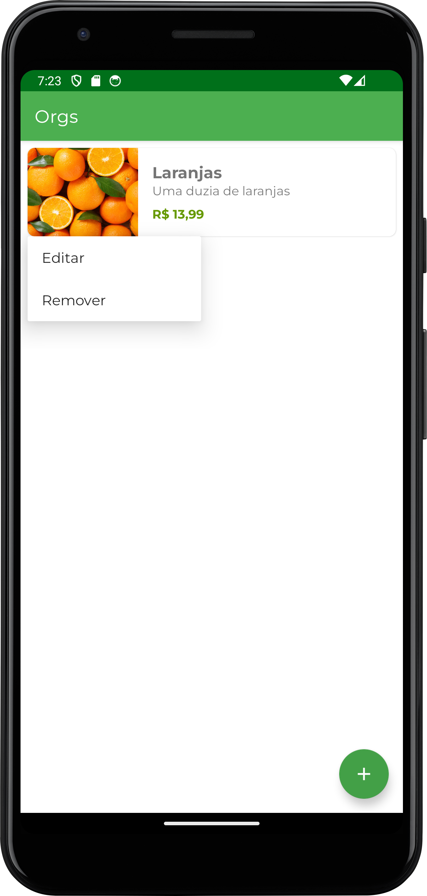
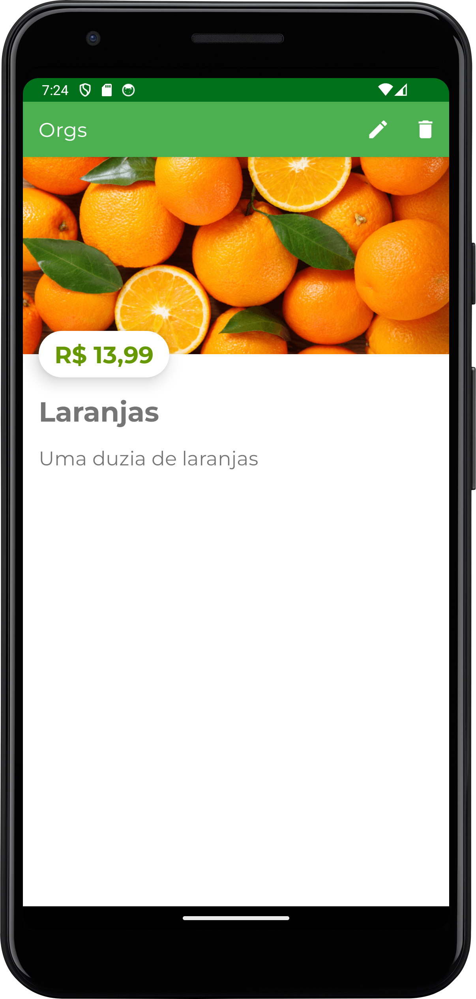

<h1>Orgs</h1>

Aplicativo para organizar e gerenciar listas de produtos.

  
  
  

 

<h1>Objetivo</h1>

O objetivo deste repositório é armazenar os códigos desenvolvidos durante o curso "Android com Kotlin: persistência de dados com Room" da plataforma Alura Cursos Online.

 

<h1>Conceitos</h1>

Os conceitos abordados durante o curso foram:

<ul>
  <li>Banco de dados SQLite;</li>
  <li>Biblioteca de persistência de dados Room;
  <li>Introdução às corrotinas do Kotlin (Coroutines);</li>
  <li>Escopos de ciclo de vida (Lifecycle Scopes);</li>
  <li>Criação de Menu (Options Menu e Popup Menu).</li>
</ul>

 

<h1>Descrição</h1>

Durante o curso, o aplicativo desenvolvido anteriormente para armazenar e gerenciar lista de produtos foi aprimorado para persistir os dados cadastrados após o aplicativo ser fechado. Além disso, foi aplicado técnicas de criação de menus, em específico, menus Option que são posicionados na Action Bar e Popup Menus que funcionam de maneira semelhante a Dialogs, porém, são ancorados em um elemento e executados de acordo com um listener.

Tais técnicas foram utilizadas para adicionar opções de Atualização e Remoção de Produtos.

 

<h1>Screenshots</h1>

  
  
  

