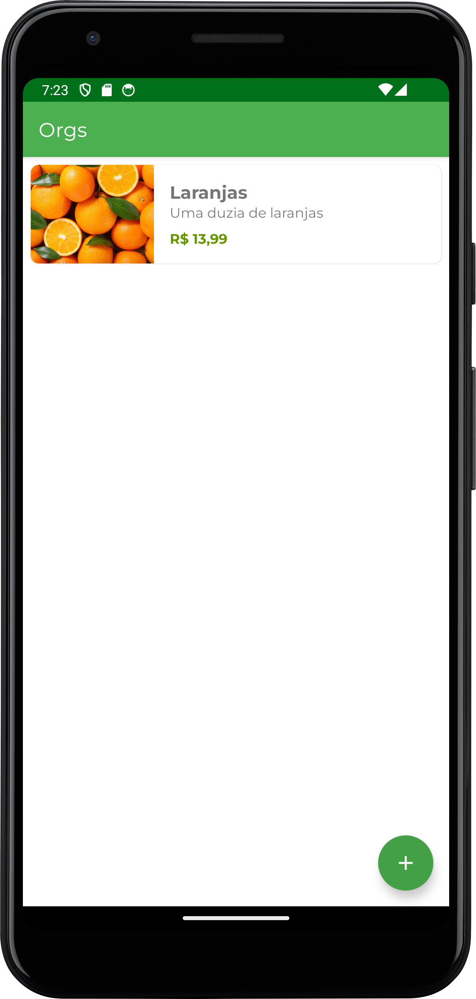

<h1>Orgs</h1>

Aplicativo para organizar e gerenciar listas de produtos.

  
  
  

 

<h1>Objetivo</h1>

O objetivo deste repositório é armazenar os códigos desenvolvidos durante o curso "Android com Kotlin: criando o primeiro aplicativo" da plataforma Alura Cursos Online.

 

<h1>Conceitos</h1>

Os conceitos abordados durante o curso foram:

<ul>
  <li>Android Manifest: para que serve, utilização;
  <li>Activities: criação, navegação e ciclo de vida;</li>
  <li>Constraint Layouts: utilidade, boas práticas;</li>
  <li>Gradle: utilidade, gestão de dependências;</li>
  <li>RecyclerView: criação, utilidade, configuração;</li>
  <li>Data Access Object: utilidade e caso de utilização;</li>
  <li>View Binding: utilização e diferenças em relação a findViewById();</li>
  <li>Boas práticas para criação de formulários em aplicativos.</li>
</ul>

 

<h1>Descrição</h1>

Durante o curso, foi desenvolvido um aplicativo que tem o objetivo de armazenar e gerenciar uma lista de produtos. Para atingir esse objetivo, foram criados duas Activities, para a página de listagem de produtos e página de formulário de cadastro, respectivamente.

 

Ao fim do curso, é informado sobre a existência do recurso de viewBinding, disponível em versões mais recentes do Android, que consiste em disponibilizar as Views criadas em arquivos .xml em forma de classes Kotlin. Entretanto, o curso não aborda o tema com profundidade e deixa a adaptação do aplicativo como um desafio final, que foi resolvido com consulta à documentação <a href="https://developer.android.com/topic/libraries/view-binding?hl=pt-br#data-binding">Vinculação de visualizações</a>, disponível no Android Developers.

 

<h1>Captura de Tela</h1>

  
  
  

